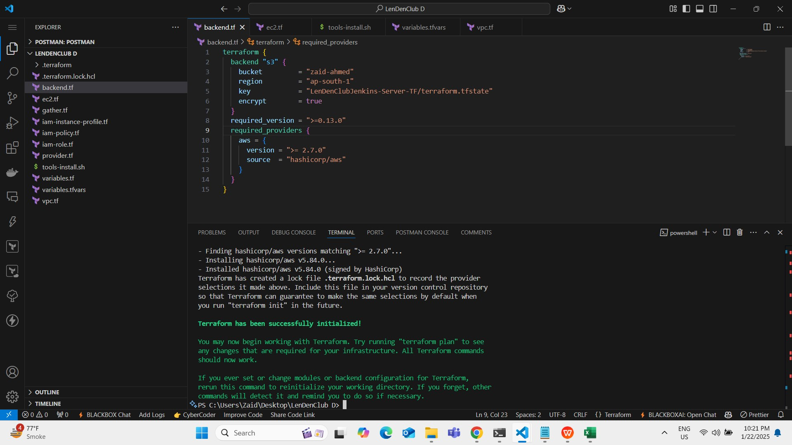
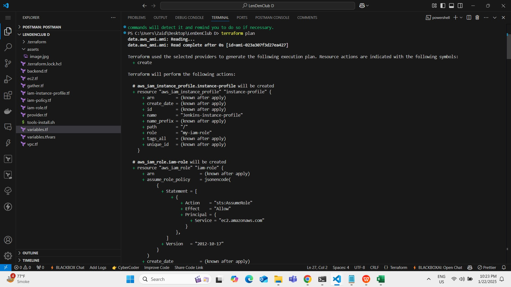
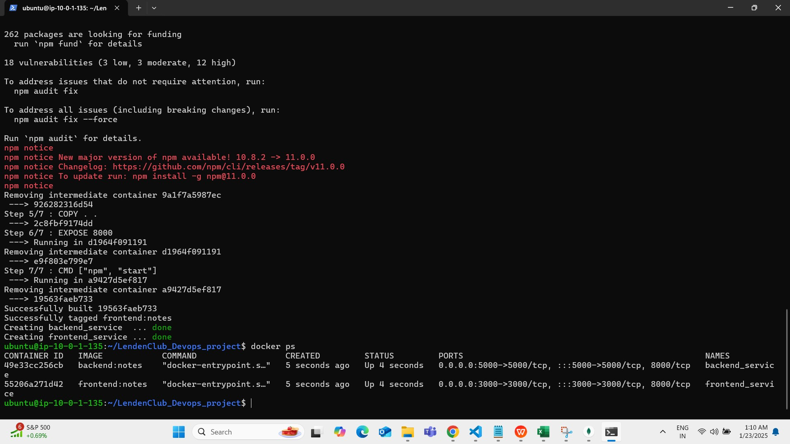
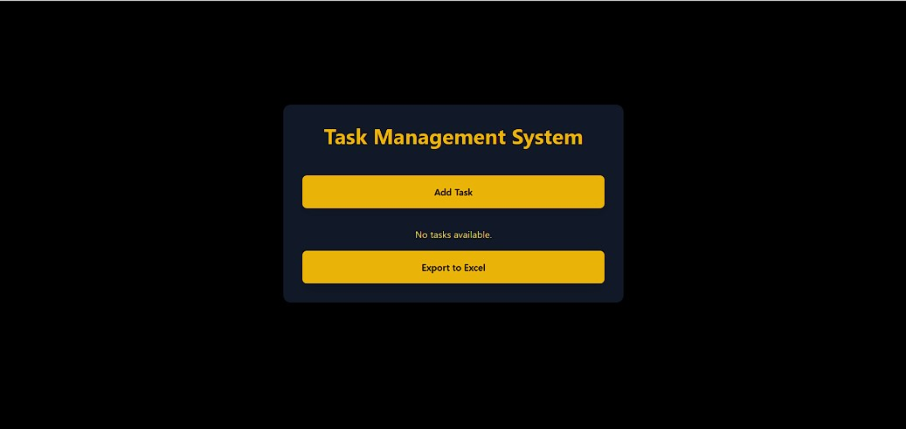
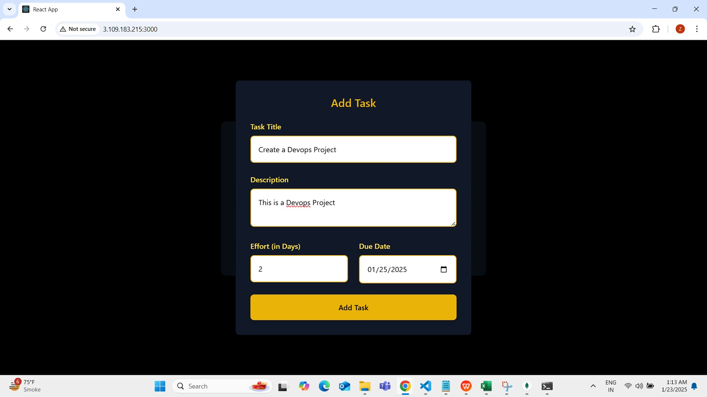
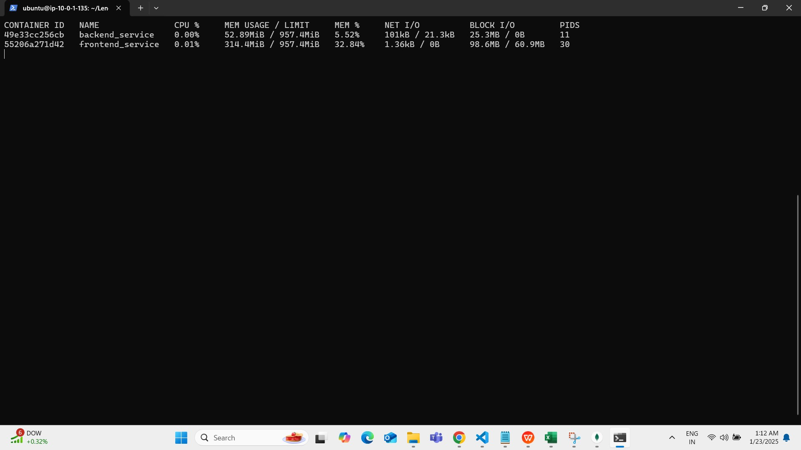

# Project Setup Guide

## Directory Structure
```
.
├── terraform/
├── backend/
├── frontend/
└── docker-compose.yml
```

## 1. Terraform Setup and Deployment

### Export Required Variables
First, navigate to the terraform directory:
```bash
cd terraform
```

Export the necessary AWS credentials:
```bash
set AWS_ACCESS_KEY_ID=<your data>
set AWS_SECRET_ACCESS_KEY=<your data>
set AWS_DEFAULT_REGION=<your data>
set AWS_CONFIG_FILE=<your data>
set TF_VAR_AWS_REGION=<your data>
set TF_VAR_AWS_ACCOUNT_ID=<your data>
set TF_VAR_ENDPOINT=<your data>
set TF_VAR_PEMFILE=<your data>
```

### Terraform Deployment Steps

1. Initialize Terraform:
```bash
terraform init
```
This command initializes Terraform, downloads required providers, and sets up the backend.


2. Review the deployment plan:
```bash
terraform plan
```
This command shows what changes Terraform will make to your infrastructure.

3. Apply the changes:
```bash
terraform apply
```
When prompted, type 'yes' to confirm the changes.


Now after docker-compose up see that your container are running properly by 
```bash
docker ps
```


## The Application is running succesfully 

Add the task



## 5. Monitoring 
 
Monitor container resources: 
```bash 
docker stats 
``` 
 
This will show real-time statistics for: 
- Container CPU usage 
- Memory usage 
- Network I/O 
- Block I/O 
 
You can exit the stats view by pressing Ctrl+C. 
 
## Troubleshooting 
 
If containers fail to start: 
1. Check logs: `docker-compose logs` 
2. Verify environment variables are set correctly 
3. Ensure all ports are available 
4. Check network connectivity 
 
For detailed logs of a specific service: 
```bash 
docker-compose logs <service_name>
```
