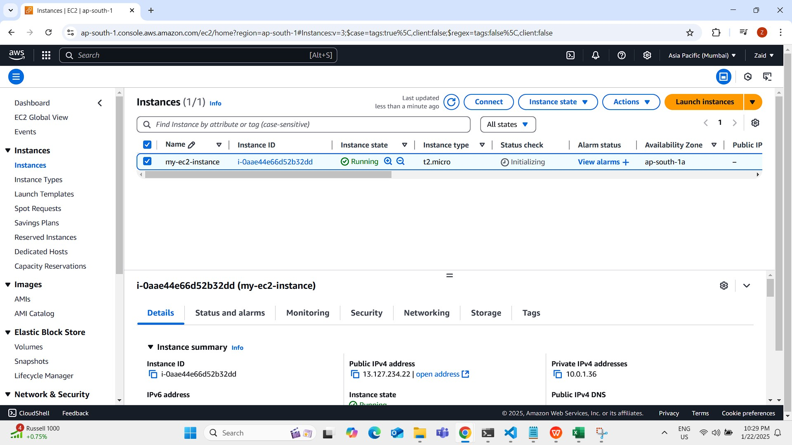
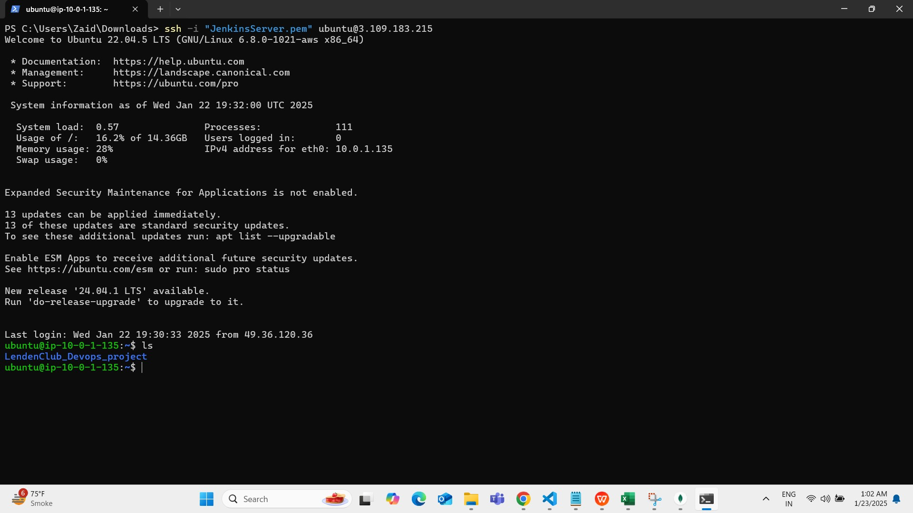
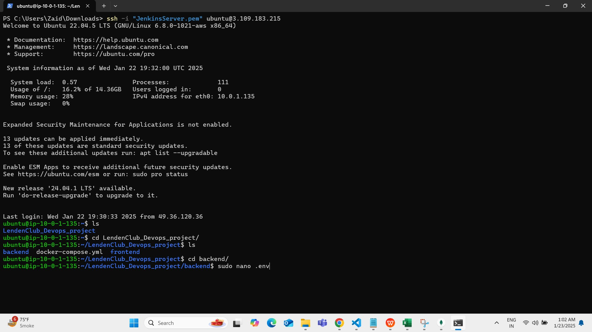
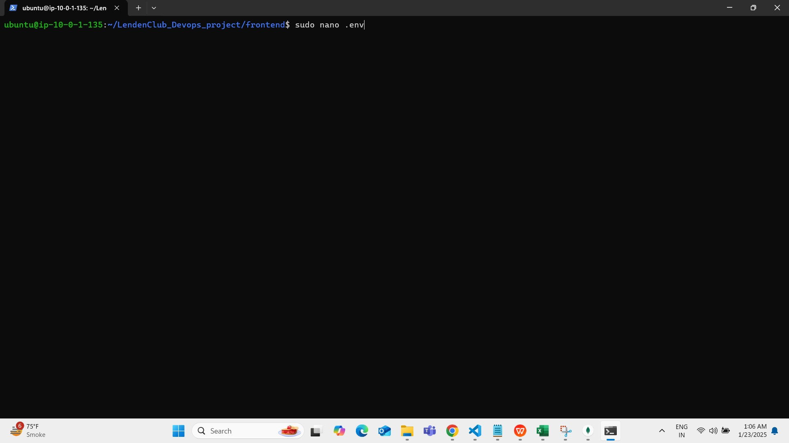
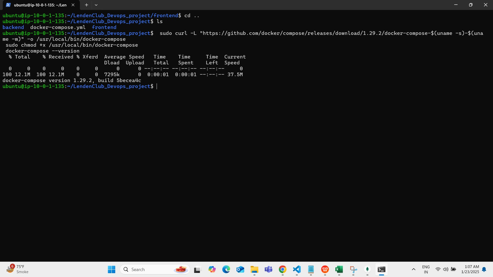
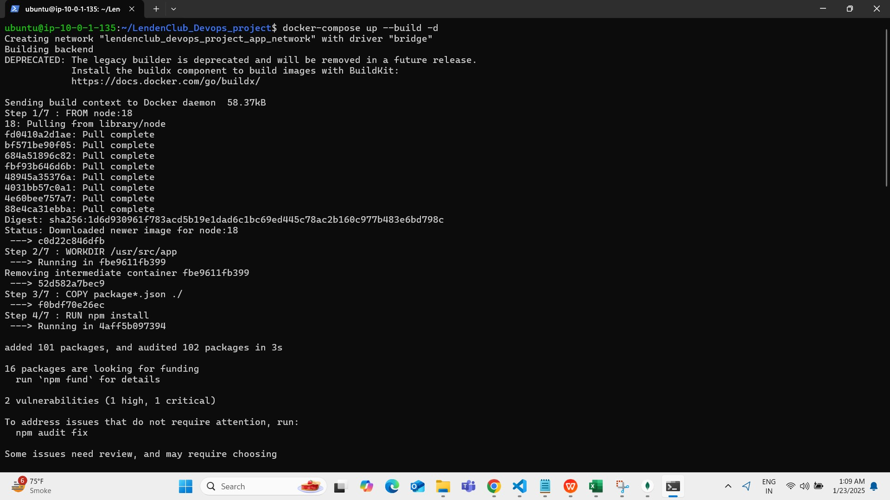

# Project Setup Guide

## Directory Structure
```
.
├── terraform/
├── backend/
├── frontend/
└── docker-compose.yml
```

## 1. Terraform Setup and Deployment

### Export Required Variables
First, navigate to the terraform directory:
```bash
cd terraform
```

Export the necessary AWS credentials:
```bash
set AWS_ACCESS_KEY_ID=<your data>
set AWS_SECRET_ACCESS_KEY=<your data>
set AWS_DEFAULT_REGION=<your data>
set AWS_CONFIG_FILE=<your data>
set TF_VAR_AWS_REGION=<your data>
set TF_VAR_AWS_ACCOUNT_ID=<your data>
set TF_VAR_ENDPOINT=<your data>
set TF_VAR_PEMFILE=<your data>
```

### Terraform Deployment Steps

1. Initialize Terraform:
```bash
terraform init
```
This command initializes Terraform, downloads required providers, and sets up the backend.


2. Review the deployment plan:
```bash
terraform plan
```
This command shows what changes Terraform will make to your infrastructure.

3. Apply the changes:
```bash
terraform apply
```
When prompted, type 'yes' to confirm the changes.


after the terraform has created this instance it will also run the tools-install.sh command while automating to install terraform docker trivy here is the example it will already be done during the creation of server no need to run it manually
```bash
#!/bin/bash
# For Ubuntu 22.04
# Installing Docker 
#!/bin/bash
sudo apt update
sudo apt install docker.io -y
sudo usermod -aG docker ubuntu
sudo systemctl restart docker
sudo chmod 777 /var/run/docker.sock

wget -O- https://apt.releases.hashicorp.com/gpg | sudo gpg --dearmor -o /usr/share/keyrings/hashicorp-archive-keyring.gpg
echo "deb [signed-by=/usr/share/keyrings/hashicorp-archive-keyring.gpg] https://apt.releases.hashicorp.com $(lsb_release -cs) main" | sudo tee /etc/apt/sources.list.d/hashicorp.list
sudo apt update
sudo apt install terraform -y

# Installing Trivy
#!/bin/bash
sudo apt-get install wget apt-transport-https gnupg lsb-release -y
wget -qO - https://aquasecurity.github.io/trivy-repo/deb/public.key | sudo apt-key add -
echo deb https://aquasecurity.github.io/trivy-repo/deb $(lsb_release -sc) main | sudo tee -a /etc/apt/sources.list.d/trivy.list
sudo apt update
sudo apt install trivy -y

git clone https://github.com/ZaidAHMED94940/LendenClub_Devops_project.git

mv LendenClub_Devops_project/ /home/ubuntu/

```

### Connecting to AWS Server
After successful deployment, get the server IP:
You will see that the server is launched 


Connect to the server:
```bash
ssh -i "your-key.pem" ubuntu@<server_ip>
```


## 2. Backend Configuration

Navigate to the backend directory:
```bash
cd ../backend
```

Create and configure the .env file:
```bash
cat << EOF > .env
MONGO_URI=<YOUR MONGO_DB_STRING>
PORT=5000
EOF
```


## 3. Frontend Configuration

Navigate to the frontend directory:
```bash
cd ../frontend
```

Create and configure the .env file:
```bash
cat << EOF > .env
REACT_APP_API_URL=http://<IP OF THE SERVER RUNNING>:3000
EOF
```

## 4. Application Deployment

### For Ubuntu/Debian:
```bash
# Update package index
sudo apt-get update

# Install dependencies
sudo apt-get install -y curl

# Download latest Docker Compose
sudo curl -L "https://github.com/docker/compose/releases/latest/download/docker-compose-$(uname -s)-$(uname -m)" -o /usr/local/bin/docker-compose

# Apply executable permissions
sudo chmod +x /usr/local/bin/docker-compose

# Verify installation
docker-compose --version
```



Return to the main directory and start the application: 
```bash 
cd .. 
docker-compose up -d --build 
``` 
 
This command will: 
- Build all services defined in docker-compose.yml 
- Start the containers in detached mode 
- Set up the network between containers 



Now after docker-compose up see that your container are running properly by 
```bash
docker ps
```


## The Application is running succesfully 

Add the task


## 5. Monitoring 
 
Monitor container resources: 
```bash 
docker stats 
``` 
 
This will show real-time statistics for: 
- Container CPU usage 
- Memory usage 
- Network I/O 
- Block I/O 
 
You can exit the stats view by pressing Ctrl+C. 
 
## Troubleshooting 
 
If containers fail to start: 
1. Check logs: `docker-compose logs` 
2. Verify environment variables are set correctly 
3. Ensure all ports are available 
4. Check network connectivity 
 
For detailed logs of a specific service: 
```bash 
docker-compose logs <service_name>
```